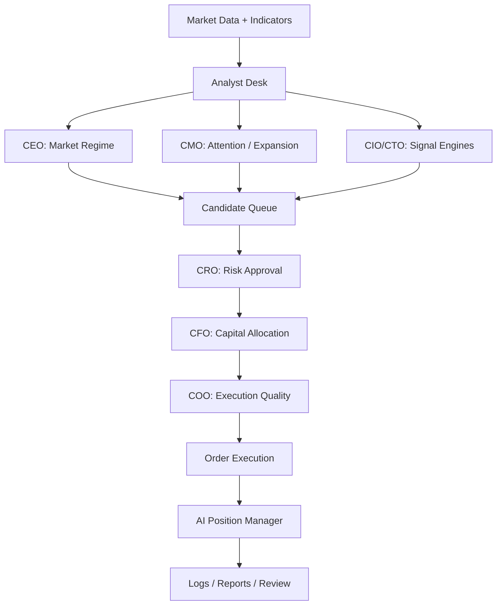

# C-Level Operating Model

Date: 2026-03-30  
Scope: live trading system operating model for role-based decision flow

## Goal

This bot should not behave like one large pile of mixed rules. It should behave like a small trading firm with clear internal roles, clear authority, and clear limits.

The purpose of this document is to lock down:

- which role sees which inputs
- which role can approve, block, or resize a trade
- which role is advisory only
- how AI is allowed to participate
- where each role maps into the current codebase

This is a control document first, not a creativity document.

## Core Principles

1. No role may act with undefined authority.
2. No AI role may expand risk beyond hard limits.
3. Technical analysis generates candidates. It does not decide capital by itself.
4. Risk and execution may veto, but must log why.
5. AI is allowed to interpret, summarize, and manage positions, but not to invent unlimited freedom.
6. Every important decision must be explainable in logs and reports.

## Operating Stack

## Role Definitions

### CEO

Mission:
- Decide the market regime for the current operating window.

Inputs:
- multi-timeframe regime summary
- engine hit rate over recent sessions
- volatility regime
- sector breadth
- macro risk window

Outputs:
- preferred regime for the session
  - continuation-led
  - reversal-led
  - defensive
  - hot-mover opportunistic
- engine priority bias
- portfolio aggressiveness mode

Authority:
- May shift operating mode.
- May not directly force a position open.
- May not override CRO hard blocks.

Current code mapping:
- partial concept only
- current nearest logic:
  - `strategy.py`
  - `strategy_engines/*`
  - `engine.py` adaptive profile / entry gating

Planned implementation:
- add a regime state builder in `engine.py` or a dedicated `c_level/ceo.py`

### CIO / CTO

Mission:
- Compute technical context and generate valid signal candidates.

Inputs:
- OHLCV
- indicators
- structure signals
- session VWAP
- squeeze state
- engine-specific rules

Outputs:
- continuation candidate
- reversal candidate
- hot_mover candidate
- scout candidate

Authority:
- May create or reject a technical candidate.
- May not approve final capital.
- May not override risk limits.

Current code mapping:
- `binance_bot/strategy.py`
- `binance_bot/strategy_engines/continuation.py`
- `binance_bot/strategy_engines/reversal.py`
- `binance_bot/strategy_engines/hot_mover.py`
- `binance_bot/strategy_engines/scout.py`

### CMO

Mission:
- Detect where market attention is expanding or collapsing.

Inputs:
- hot mover scan
- quote volume expansion
- CoinGlass coverage / market breadth
- sector flow
- recent listings / crowd attention

Outputs:
- urgency tag
- attention score
- hot_mover / scout promotion

Authority:
- May increase candidate urgency.
- May not enlarge risk by itself.
- May not bypass CRO.

Current code mapping:
- `binance_bot/hot_movers.py`
- `binance_bot/coinglass_client.py`
- `binance_bot/external_sources.py`
- `binance_bot/sectors.py`

### CRO

Mission:
- Protect the account first.

Inputs:
- daily and weekly drawdown
- stop distance
- total open risk
- same-sector exposure
- correlation clusters
- emergency state
- slippage / integrity warnings

Outputs:
- allow
- deny
- reduced-risk relief
- emergency stop

Authority:
- Final veto on opening risk.
- May allow reduced-risk exceptions under defined rules.
- May not move hard stops looser than existing rules.

Current code mapping:
- `binance_bot/risk.py`

### CFO

Mission:
- Decide how much capital should be deployed and how much should remain protected.

Inputs:
- account equity
- daily realized PnL
- remaining risk budget
- engine family
- stage / symbol tier
- practical daily profit target

Outputs:
- position count budget
- notional sizing
- stage cap
- exploratory vs normal size

Authority:
- May reduce size.
- May distribute capital across multiple candidates.
- May not authorize trades denied by CRO.

Current code mapping:
- `binance_bot/sizing.py`
- `binance_bot/risk.py`
- parts of `binance_bot/engine.py`

### COO

Mission:
- Ensure the trade can be executed cleanly now, not just theoretically.

Inputs:
- stale signal timing
- session windows
- microstructure
- spread
- orderbook depth
- invalid symbol checks
- service health

Outputs:
- executable now
- stale / skip
- retry later
- execution downgrade

Authority:
- May veto stale or low-quality execution.
- May not rewrite strategy bias.

Current code mapping:
- `binance_bot/engine.py`
- `binance_bot/exchange.py`
- `scripts/healthcheck_live.ps1`

### AI Position Manager

Mission:
- Manage open positions after entry.

Inputs:
- current position
- updated scan
- horizon context
- sector context
- microstructure
- practical daily profit target
- recent move quality

Outputs:
- hold
- reduce_25
- reduce_50
- tighten
- raise_target_small
- exit_now

Authority:
- May manage open positions only.
- May not widen hard stop.
- May not average down.
- May not exceed hard risk rules.

Current code mapping:
- `binance_bot/ai_position_manager.py`

## Hard Boundaries

These are non-negotiable.

- CEO cannot force-open a blocked trade.
- CMO cannot bypass CRO.
- CFO cannot increase risk above global caps.
- COO cannot promote a technically invalid setup into a valid one.
- AI Position Manager cannot widen stop loss or add size.
- AI cannot act without a logged reason.

## Minimum Data Required Per Trade

Every trade must carry:

- `engine_family`
- `engine_key`
- `setup_type`
- `entry_profile`
- `signal_bar_time`
- `entry_profile_score`
- `confirmation_score`
- `risk decision reason`
- `sizing decision reason`
- `execution timing / freshness`

This is mandatory for auditability.

## Default Role Behavior

### Continuation Day

- CEO favors continuation
- CIO/CTO continuation engine gets priority
- CRO remains strict on trend conflict
- CFO allocates more to clean continuation setups
- CMO has lower influence unless expansion is extreme

### Reversal Day

- CEO shifts to transition / reversal mode
- reversal engine gets more candidate room
- CRO still limits size
- CFO keeps reversal size smaller than continuation unless proven
- COO enforces short freshness windows

### Hot Mover Window

- CMO has higher urgency influence
- hot_mover candidate can enter queue faster
- CRO keeps size very small
- CFO caps notional and count
- COO requires stricter execution quality

## Current vs Planned State

### Current State

- CIO/CTO has become partially engine-split.
- CRO is real and active.
- CFO is partially real.
- COO is real in practice, but distributed.
- CMO exists in fragments.
- CEO is mostly implicit, not explicit.
- AI Position Manager exists.

### Planned State

Phase 1:
- lock this role model
- map every gate to one owner

Phase 2:
- add explicit CEO regime state
- add explicit CFO allocator summary
- add explicit COO execution summary

Phase 3:
- reporting by role
- reason logs by role
- veto statistics by role

## Reporting Standard

Every daily or weekly review should answer:

- Which role blocked the most trades?
- Which role protected the most loss?
- Which role caused unnecessary missed opportunity?
- Which engine family earned the most?
- Which engine family consumed risk with the worst expectancy?

This should make the system easier to tune than the current “everything blocks everything” structure.

## What This Prevents

Without this structure:

- AI turns into an expensive vague filter
- strategy filters overlap with risk filters
- execution problems look like technical problems
- nobody knows which layer caused failure

With this structure:

- each decision has an owner
- each owner has limits
- AI is useful without becoming uncontrolled
- tuning becomes measurable

## Immediate Next Implementation Targets

1. Add explicit `regime_state` owned by CEO layer.
2. Add explicit `allocator_summary` owned by CFO layer.
3. Add explicit `execution_readiness` owned by COO layer.
4. Add daily report grouped by role veto.
5. Keep AI limited to position management until role boundaries are stable.
